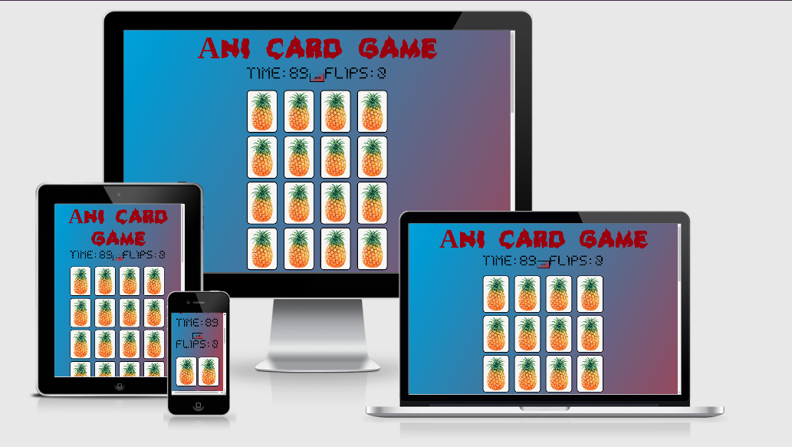

# Ani card game

A fun anime/ gaming related card matching game -
where the goal is to match two of the hidden cards together, complete the board in the shortest amount of time and with as few flips as possible.
Hopefully, too boost one's memory/ get it going.

Meant for viewing on a desktop/ laptop/ tablet where there is more screen real estate.
Hosted on [GitHub Pages](https://ghost01123.github.io/js-project-card-game/index.html)
Repository on [GitHub](https://github.com/ghost01123/js-project-card-game)

## UX



### Users 
Expected users of the website are gamers/ friends or people just looking for a basic fun memory game.

### User Stories
- A gamer on the website I want to have fun, playing a simple game that works with interesting/ engaging features.

- As someone who won't's to play a memory game, a functional game which exercises one's memory is a requirement 

- my goal is to adapt/ make an enjoyable game that plays well, is easy to understand plus looks good so interested parties would wont to play it and also learn while doing creating it. 

### Design
- Colour scheme consists:
    - Tweaked versions of archaic ('assets/images/ditf.jpg') colours using https://www.w3schools.com/colors/colors_picker.asp)
    - (https://coolors.co/) - to select a lighter colour for the overlay text
    - custom font's used throughout the website - https://www.urbanfonts.com
    - (backup) font-family: Georgia, serif

- UX elements
    - Animations
    - Transitions
- Git - Version Control System
- GitHub - Remote Repository
- Deployed - Hosted on Github Pages

### Existing Features
- Documentation 
- JavaScript focused development
- overlays
- grids
- Colour Scheme
- Responsive view
- UX elements
    - Animations
    - Transitions
- Git - Version Control System
- GitHub - Remote Repository
- Deployed - Hosted on Github Pages


### Features Left to Implement
- Background music selector ( so one can change or mute the background audio)
- Added cards/ rows for harder difficulty/ larger screens 
- fewer, smaller cards for smaller screen sizes.

## Technologies Used

This project makes use of:
- HTML
- [CSS](https://developer.mozilla.org/en-US/docs/Web/CSS)
    - CSS for Styling
- [CSS + JavaScript](https://www.w3schools.com/jsref/)
- [JavaScript research](https://stackoverflow.com/)
- Chrome - Used for browser and dev tools
- [Mozilla Firefox](https://www.mozilla.org/en-US/firefox/new)
    - Used for browser and dev tools
- [duckduckgo](https://duckduckgo.com/)
    - **duckduckgo** was used for research.
- [Visual Studio Code](https://code.visualstudio.com/)
    - This project was built using the **VS Code** IDE
- [GitHub](https://github.com/)
    - Repository hosted on **GitHub**
- [Github Pages](https://pattern-projects.github.io/oireachtas-ifd-project/)
    - Website hosted on **Github Pages**
- [Am I Responsive](http://ami.responsivedesign.is)
    - Testing responsiveness of the website

## Testing

The site was tested through several means:
 
1. Testing - Open .html in the root directory
2. Run using a live server process
3. Testing on a tablet too see how it would look and work on a smaller screen
4. non-automated testing by playing the game and seeing what bugs come up
5. Getting other people too test out the game and report back to me what they find. 
6. Also, javascript validating via ... https://codebeautify.org/jsvalidate 
7. HTML and CSS validating via... https://validator.w3.org/


## Deployment

The project is hosted on [GitHub Pages](https://ghost01123.github.io/js-project-card-game/index.html)

The process involved:
- Host a git repository on GitHub. Explained [here](https://help.github.com/en/articles/create-a-repo).
- The root folder contains README.md and index.html files
- On GitHub, repository settings page move to GitHub Pages section
- Change source to master branch. (Or any desired branch)
- Provided link will be your projects home (index) page.
 
To deploy your version of the website:
- Have git installed
- Visit the [repository]([GitHub](https://github.com/ghost01123/js-project-card-game))
- Click 'Clone or download' and copy the code for HTTP
- Open your chosen IDE (sublime text, VS Code, etc.)
- Open a terminal in your root directory
- Type 'git clone ' followed by the code taken from GitHub repository
    - ```git clone https://github.com/ghost01123/js-project-card-game.git```
- When this completes you will have your own version of the website
    - Feel free to make any changes to it
- The website can be run by opening one of the HTML files in your browser
- Visit the link provided
- Saved changes to the website will appear here after refreshing the page

The benefits of hosting your website on GitHub pages is that any pushed changes to your project will automatically update the website. Development branches can be created and merged with the master when complete.

During development, the site was written using VS Code +Live Server plugin for VS Code.


## Credits

### Media
- https://www.freepngs.com/search-pngs
- https://pngtree.com/
- flip sound - https://freesound.org/s/240776/

- background music: performed by Mika Nakashima, written by HYDE, source: Sony Music Labels Inc.

- game over sound - https://freesound.org/s/277403/

- well done sound - https://freesound.org/s/436164/

- www.rw-designer.com/

- https://www.urbanfonts.com

### Acknowledgements
tutorial - 
https://www.youtube.com/watch?v=ZniVgo8U7ek

read me - 
https://github.com/Pattern-Projects
